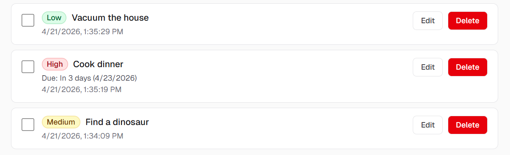
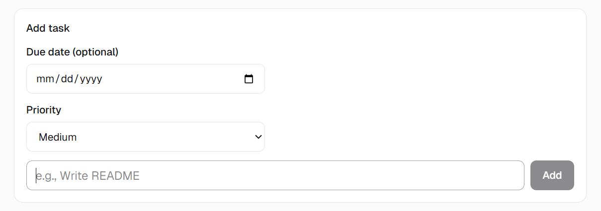
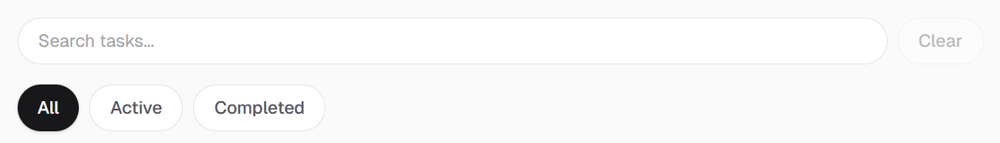

# Task Manager (Next.js)

A minimal task manager built with the Next.js App Router. Create tasks with **priority** and an optional **due date**, then **search**, **filter**, **edit**, **complete**, or **delete** them.

> Note: this project uses an **in-memory API** for storage (`app/api/tasks/route.ts`), so tasks reset when the dev server restarts.

## Features

- **Create tasks**: add a task with priority (High/Medium/Low) and optional due date
- **Inline edit**: edit task text directly from the list
- **Complete / incomplete**: checkbox toggle
- **Delete with confirmation**: prevents accidental removal
- **Search + filtering**: search by text and filter by All / Active / Completed
- **Due date helpers**: human-friendly labels (Today/Tomorrow/In X days) + overdue styling
- **Dark mode styling**: optimized for light/dark themes

## Technologies used

- **Next.js 16** (App Router)
- **React 19**
- **TypeScript**
- **Tailwind CSS v4**
- **ESLint**

## Installation

```bash
cd nextjs/task-manager
npm install
```

## Run the app

### Development

```bash
npm run dev
```

Then open `http://localhost:3000`.

### Production build

```bash
npm run build
npm start
```

## How to use

- **Add a task**: choose a priority, optionally pick a due date, type the task, then click **Add**
- **Mark complete**: use the checkbox
- **Edit**: click **Edit** (or click the task text) → update → **Save**
- **Delete**: click **Delete** and confirm
- **Search**: use the search box (and **Clear** to reset)
- **Filter**: switch between **All / Active / Completed**

## Screenshots




